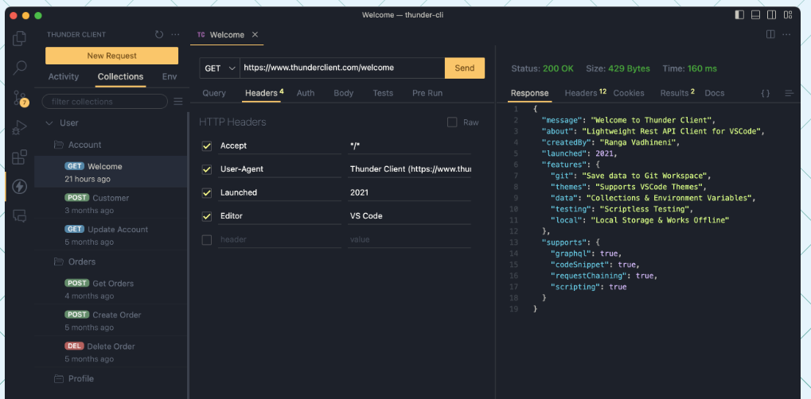

# Servidor a partir de un archivo json
1. Creamos proyecto
2. Instalamos json serve: `npm i json-server` (https://www.npmjs.com/package/json-server
)
3. Creamos db.json
4. Ejecutamos servidor `json-server --watch db.json`
5. Probamos servidor navegando a los siguientes Endpoints:
 - http://localhost:3000/posts
 - http://localhost:3000/comments
 - http://localhost:3000/profile
6. Instalamos en VSCode la extensión Thunder Client for VS Code
 

7. Probamos peticiones de tipo get, post, put, delete

